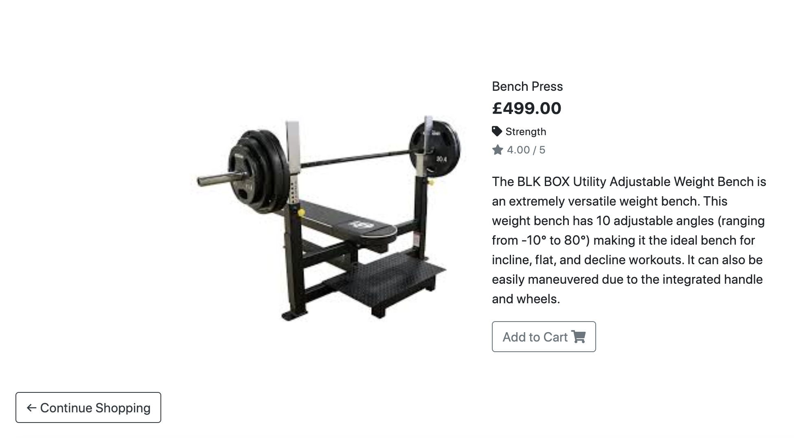
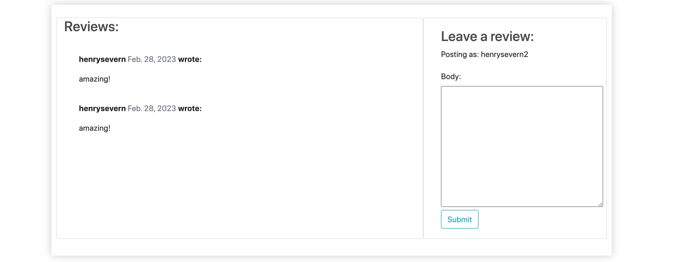
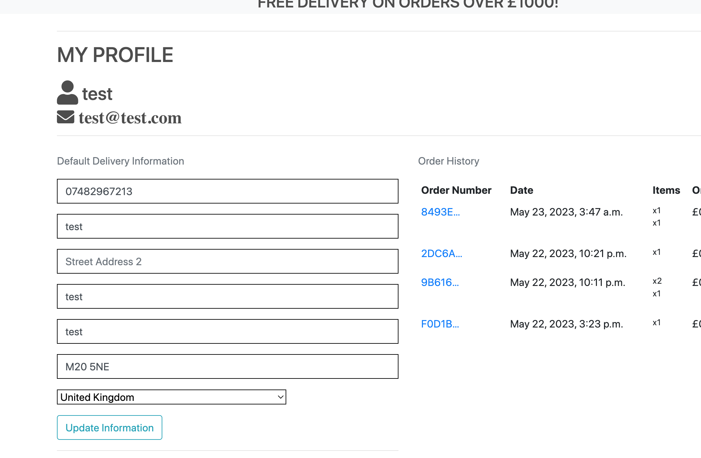

# Gym Shop

This website is a full stack ecommerce store to allow people/gyms to buy commercial gym equipment from the mockup plant company Gym shop.

To visit the website, please visit the deployed site [here](https://gym-shop.herokuapp.com/).


## Target Audience
- People looking to buy gym equipment for a home gym.
- Commercial gyms looking to buy wholesale equipment for a gym.
- People looking to get into shape by purchasing exercise equipment.

## User Stories
1. User Authentication / Accounts
- Site users should be able to register an account that allows a user to sign in and out of the site.
- A user should be able to create a profile to store personal information to make checkout easier with default personal information to automatically populate form fields at checkout.
- Users should be able to amend profile information to keep records up-to-date.
- A user should be able to reset their password via email so the account is not lost if the password is forgotten.
2. Site Navigation
- Site users should be able to navigate fluidly throughout the website without having to use the back button.
- A user should be able to direct themselves through the site with confidence and clarity to where they are navigating to.
- Users should be able to search the site for specific related content that they seek.
3. Shopping
- Users should be able to view the products that GymShop offer for purchase.
- A user should be able to add any products they want to buy to their shopping bag for review.
- A user should be able to add multiples of an item to their shopping bag if they so wish.
- Users should be able to filter and sort results based on their shopping goals.
- Site users should be able to view all product information before adding a product to their bag.
4. Cart
- Users should be able to view all items, and quantities that they have added to their shopping cart.
- Site users should be able to amend their order in their cart, changing the quantities of a product or removing the product entirely from the cart.
- A user should be shown the delivery costs and any additional costs of their order.
- Users should be able to safely navigate to the checkout to finalise their order.
5. User Checkout
- A user should be able to checkout securely and pay for their order, finalising the transaction and confirming delivery address.
- Once checked-out, a customer should receive confirmation of their order.
6. Profiles
- Site users should be able to create a profile to store their default delivery address, which will auto-populate the checkout view. 
- Site users should also be able to view their previous order history.
- Profile users should be able to signin, signout, view their profile and amend their default delivery information. 
7. Contact 
- All site users should have the ability to contact GymShop.
8. Site Admin
- Site admins should have secure access to product management.
- Admins will be able to add new products.
- Admins will be able to edit existing products.
- Admins will be able to delete products from the store.
- See all orders, products, product categories, and customer messages.

### Wireframes

- Store wireframe

 


 - Product View wireframe

 


## Database Model

- GymShop Database Model

 


## OUTSTANDING BUG
*** Please read ***
- When user signs up there is an error when the button is pressed saying the user has no customer. This is because ive tried to develop a customer model where anonymous users can checkout and pay, I built my app of that and then was going to impliment user log in. If you use the superuser to create a customer for the user then the functionality works fine.
- For quick fix I could have implimented a quick form during sign up to populate the customer model with the users information. The models and views need adjusting to aloow for both logged in users and anonymous users to checkout and pay. I ran out of project time to impliment this.


## Features 

### Existing Features 

__Navigation Bar__
- Allows the user to navigate around the GymShop site. The GymShop logo will direct the user to the homepage, there's an Account Management button with dropdown options relating to profile creation and login, and there's a button to take a user to their Shopping Cart. The shopping cart icon number changes if there are items currently sitting in the cart.
- The search bar allows users to search for a keyterm throughout the site, this is useful if the user has a particular product in mind to purchase.
- Buttons will be available to the user depending on whether they are logged into their account or not.
- The mobile navbar condenses all the same elements into a burger menu, this retains screenspace for other elements e.g., products.
- The lower part of the nav bar contains categories for easy and quick product search based on what the user wants to purchase.


__Footer__
- The footer contains the address of the company, useful links, business information and links to social media accounts. All of which either open modals or open new tabs directed away from the website.
- The footer design matches that of the header to give a cohesive feel to the website.


__Store__
- The store displays the products that the user is able to buy through the website.
- Each product has its own info card where the user can see to which category the product belongs, price and rating.


__Product Details__
- Each product detail page shows the product name, price, catergory, rating, and product description.
- From this page, users can add the product to basket.



__Comments__
- In the product detail page each product has a review section.
- A user can submit a review of the product and view other users authorised reviews.
- Once the user has submitted a message the comment will show once and admin has reviewed the comment and authorised.
- This gives the users a little more interaction with the website allowing users to view what other think of the product.



__Product Filtering__
- Users are able to search for words in the search bar. Any keywords that a user enters, only products relating to those words are displayed. These keywords can be in the title or product description.


__The cart__
- The cart is always accessible to registered users, even when empty. The cart allows users to view what is currently in their bag for purchase. From here, a user can amend their order, continue shopping or proceed to checkout.


__Checkout__

- Once product(s) have been added to the cart the user will then be able to checkout. Upon checkout there is a brief review of the users basket i.e., what they intend to purchase. The user will then be required to fill out their delivery information to then proceed to fill out their payment information.


__Payment__

- The user will then be required to fill out their payment information. Once payment is completed the order is made.


__Order Confirmation__

- Once payment has been processed and an order created, a user will be directed to an order confirmation page listing their order details and a button to redirect back to the store. Additionally, there will be a toast alerting the user of their order success and a confirmation email will be sent to the email adress the customer provided.


__Contact page__
- If a user wants to contact GymShop, they can do so by filling out the form on the Contact Us page. Once the user has submitted this form they will be redirected to a success page to inform them that their message has been received and the company will be in touch shortly. An admin can see submitted contact forms in the django admin for the site.


__Account Management__
- A user is able to create a profile by registering an account. Having an account allows users to save delivery details for faster checkout and to view past order history.
- A user can navigate and manage their account by using the button dropdown in the navbar.
- A user can sign in and out of their account, they are also able to reset their password via email verification. The back-end functionality of accounts is handled by django-allauth.


__Profile__
- A user's profile displays the user's past order confirmations alongside their default delivery information. Delivery information can be edited and saved in their profile to ensure their account details are always accurate.




### Admin Features

__Adding Products__
  - An admin has the ability to add new products by navigating to the product management section under their account, which of course requires an admin signin. Completing and submitting the add product form will result in a new product being displayed on the site. This will create a permanent object in the database which will remain until updated or deleted. Users will now be able to purchase this product.


__Editing and Deleting products__
- These admin control buttons (update and delete) are only present if the user that is logged in is a superuser i.e., an admin account.


- From a products's details page, an admin can easily update the details of said product. Clicking update opens a form, once completed and saved the data on this product will be updated in the database.


- From a products's details page, an admin can easily delete said product. Before deletion a modal is triggered to ensure no accidental deletion.
- Once deleted this product will be permenantly deleted from the database.


__Django Admin__

## Marketing & search engine optimization
I have used several marketing techniques in the project in order to attract customers.

1. Keywords & description
- I have used several keywords that relate to the products gymshop sells on the application;
  ```
  <meta name="description"
    content="Build your own commercial or home gym with GymShop, the only place to buy your gym equipment.
    From Treadmills, to Strength Machines, to a simple yoga mat. We have everything you need at GymShop ">

  <meta name="keywords" content="home gym, homegym, gym, gym shop, gym equipment, 
  home weights, strength machines, fitness, fitness equipment, cardio, weights, dumbbells, 
  treadmill, getting fit">
  
  ``` 
- I feel like the keywords here are what customers after gym equipment would type into search engines 

2. Newsletter signup
- Newsletter sign up has been added to this project. The newsletter is a small pop up on the webiste that allow users to sign up to GymShops email newsletter. I have chose email marketing as this marketing approach suits the site. I feel that customers after gym equipment only need regular updates/information on content not so often like a social media.


3. Facebook page/Social media 
- A facebook buisness page has been created for this application also. As facebook has the most users over any other social media platform this is where ive chosen to publish a buisness page. Here facebook useres can find direct links to the shop, contact for questions, see locations details as well as posts GymShop publishes.


4. Sitemap.xml
- A sitemap file has been made for this application. A sitemap is a file where you provide information about the pages, videos, and other files on your site, and the relationships between them. Search engines like Google read this file to crawl your site more efficiently. Please read more about sitemaps [here](https://developers.google.com/search/docs/crawling-indexing/sitemaps/overview#:~:text=A%20sitemap%20is%20a%20file,crawl%20your%20site%20more%20efficiently.).

5. Robots.txt
- A robots.txt file is also included in this application. A robots.txt file tells search engine crawlers which URLs the crawler can access on your site. This is used mainly to avoid overloading your site with requests; it is not a mechanism for keeping a web page out of Google. Please read more about robots.txt [here](https://developers.google.com/search/docs/crawling-indexing/robots/intro).

6. Nofollow
- No follow attributes are used on social media links in this application. A nofollow tag is a basic piece of HTML. Appended to a hyperlink, it allows webmasters to control whether search engines follow a link or not. For example, the following URL on a page of another site allows search engines to visit GymShop’s website and credit the website with the link; each link is scored by the search engines, supporting SEO.


### Making an admin account
Admin accounts are defined as superusers and have to be made a specific way, different to a normal GymShop customer account.

To make an admin account for your local workspace:
  - In the CLI run `python3 manage.py createsuperuser` then provide an admin username and password. 
  - You can then login to your admin account with this username and password to get admin privileges.

To make an admin account for a deployed Heroku site:
  - Ensure your git repository is connected to the Heroku app.
  - Make sure a remote has been established for the Heroku app (you can check this by running `git remote -v` in your terminal).
  - You will now need to login to your Heroku account in the CLI, to do this run `heroku login -i` and provide your Heroku email address associated with your account and account password.
  - Ensure all migrations have been made to the Heroku app.
  - Create a superuser by running `heroku run python3 manage.py createsuperuser`.
  - You can then login to your admin account with this username and password to get admin privileges.

### Features left to impliment
- A dynamic pop up model to explain what the site is about with a shop now button.
- More catergory filtering, there is not many products on the site but if there was to be lots would be helpful for the user to be able to filter 
   more easily with suggestion products.
 - Add digital wallets for easier checkout.
  - This would make checkout simpler and faster for the user by paying with the click of a button rather than filling out their card details into the Stripe input.
  - However, Stripe's documentation warns that the integration of digital wallets are "currently only available in the U.S., and not yet available in the UK and euro area." Therefore, this would need to change or I would need to change online payment provider before this could be implemented.
  - Please see the [Stripe Docs](https://stripe.com/docs/issuing/cards/digital-wallets) explaining how digital wallets can be intergrated into Stripe in the US.
- Checkout Webhooks
  - Adds redundancy to the order payment in case the browser is closed after the payment is confirmed but before the order form has been submitted. This would stop the chance of payment going through without the order having been created.
  - I would follow the [Stripe documentation](https://stripe.com/docs/webhooks) on webhooks and follow Code Institute's walkthrough project in order to implement webhooks in my site.
- Improve cart functionality 


## Technologies

- [GitPod](https://gitpod.io) was used as a cloud based iDE
- [GitHub](https://github.com/) was used to manage the Git repository
- [Heroku](https://deilen-shop.herokuapp.com/) was used for deployment
- [Git](https://git-scm.com/) was used for version control
- [Django](https://www.djangoproject.com/) used as the project's web framework
- [Pip3](https://pip.pypa.io/en/stable/) was the package manager used to install the dependencies
- [Bootstrap](https://getbootstrap.com/) was used for website layout and responsive components
- [AWS S3 Buckets](https://aws.amazon.com/products/storage/?hp=tile&tile=solutions) was used to provide storage of static and media files for the deployed 
- [Gmail](https://mail.google.com/mail) was used for an STMP server to send company emails
- [PostgreSQL](https://www.postgresql.org/) was used as the project's database management system 
- [Am I Responsive](http://ami.responsivedesign.is/) was used to generate a mock-up image
- [Wireframe.cc](https://wireframe.cc/pro/) was used for creating wireframes
- [DrawSQL](https://drawsql.app/) was used for creating the database schema
- [Dev Tools](https://en.wikipedia.org/wiki/Web_development_tools) was used for testing and responsiveness
- [W3C HTML Validator](https://validator.w3.org/#validate_by_input+with_options) and [W3C CSS Validator](https://jigsaw.w3.org/css-validator/#validate_by_input) were used to check HTML and CSS files for errors
- [pep8ish](https://pep8ish.herokuapp.com/) is Code Institute's Python Linter and was used to check Python files for errors

### Languages
- [HTML](https://en.wikipedia.org/wiki/HTML) was used as the markup language
- [CSS](https://en.wikipedia.org/wiki/CSS) was used for custom styling
- [JavaScript](https://en.wikipedia.org/wiki/JavaScript) was used for custom website interactivity
- [Python](https://www.python.org/downloads/) was used for the backend functionality of the site

## Testing

To view all testing documentation, refer to [TESTING.md](TESTING.md).


## Deployment

The site was deployed to Heroku. The live link can be found [here](https://gym-shop.herokuapp.com/)

The steps to deploy a Heroku app are as follows: 
1.  Log in to Heroku or create an account if required.
2.  Create a Heroku app - select 'New', from the drop-down menu select Create New App. The app name provided must be unique.
3.  Select a region.
4.  Create.
5.  Navigate to the Resources tab and add a Heroku PostgreSQL database.
6.  Access the Settings Tab and find the Config Vars. For this project you will need the following config vars:
    *   DATABASE_URL = the url of your heroku postgres database.
    *   SECRET_KEY = a secret key for your app.
    *   PORT = 5000
    *   DEBUG = set to 'True' during development and 'False' upon deployment.
    *   USE_AWS = set to 'True'.
    *   AWS_ACCESS_KEY_ID = amazon web services publishable API key.
    *   AWS_SECRET_ACCESS_KEY = amazon web services secret API key, must be stored securly.
    *   STRIPE_PUBLIC_KEY = stripes publishable API key.
    *   STRIPE_SECRET_KEY = stripes secret API key, must be stored securly.
    *   EMAIL_HOST_PASS = 16 character password given once SMTP server setup in mail account settings.
    *   EMAIL_HOST_USER = the active email address that site emails will be sent from.

 Please see this [official documentation](https://devcenter.heroku.com/articles/config-vars) on Heroku configuration for more details.

7.  Navigate to the Deploy tab.
8.  Select Github as the deployment method.
9.  Follow steps to link to the appropriate GitHub account.
12. If you wish, enable Automatic Deploys for automatic deployment when you push updates to Github. Or alternatively, select the correct branch for deployment from the drop-down menu and click Deploy Branch for manual deployment.

Final steps: 
1. Create a Procfile in your repository containing `web: gunicorn deilen.wsgi:application` so that Heroku will identify that Gunicorn is acting as the webserver and run using the projects wsgi module.
2. Create an untracked file called env.py in your repo and input the config vars you previously established in Heroku.
3. Create a requirements.txt file
    - If you want to freeze your own packages into this file, run `pip3 freeze --local > requirements.txt` in the console.
    - To install only the packages that are already listed in the Deilen repo requirements (if making a local copy/clone) run `pip3 install -r requirements.txt` in the console.

### Setting up Stripe
For instruction to set upstripe payments, please visit [the Stripe documentation](https://stripe.com/docs/payments/accept-a-payment#web-collect-card-details).
Provided below is a brief explanation of Stripe setup:

1. Create a **stripe account** at [stripe.com](https://stripe.com/en-gb)
2. In the terminal, install Stripe:
```
pip3 install stripe
```
3. In the project settings file, ensure `STRIPE_CURRENCY` is set to 'gbp' and `STRIPE_PUBLIC_KEY` and `STRIPE_SECRET_KEY` are retirived from the environment, with a default empty value, e.g.:
```
STRIPE_PUBLIC_KEY = os.environ.get('STRIPE_PUBLIC_KEY', '')
STRIPE_SECRET_KEY = os.environ.get('STRIPE_SECRET_KEY', '')
```
4. These API keys are avliable to you from the **home** page of your Stripe account, under a section titled **"for developers"**. Copy the **Publishable key** and assign it to a new Heroku config var called `STRIPE_PUBLIC_KEY`. Then do the same for the **Secret key**, assigning it to a config var called `STRIPE_SECRET_KEY`.


### Setting up AWS
The deployed site uses AWS S3 Buckets to store the webpages static and media files. More information on how you can set up an AWS S3 Bucket can be found below:

1. Create an AWS account [here](https://portal.aws.amazon.com/billing/signup#/start/email).
2. Login and locate **S3 buckets** and create a new bucket.
3. Underneath **Object Ownership** select **ACLs enabled**.
4. Uncheck **Block Public Access** to make the bucket public, then finally **Create Bucket**.
5. Inside your new bucket navigate to the **Properties** tab. Within **Static Website Hosting** click **Edit** and edit the Static website hosting to **Enabled**. Copy the default values for the index and error documents and click **Save Changes**.
6. Navigate to the **Permissions** tab, within **Cross-origin Resource Sharing (CORS)**, click **Edit** and then paste in the following:

  ```
    [
        {
            "AllowedHeaders": [
            "Authorization"
            ],
            "AllowedMethods": [
            "GET"
            ],
            "AllowedOrigins": [
            "*"
            ],
            "ExposeHeaders": []
        }
    ]
  ```

7. In the **Bucket Policy** section click **Edit** and then **Policy Generator**. Open the **Select Type of Policy** dropdown, select **S3 Bucket Policy** and within **Principle** allow all principals by typing *.
8. Open up **Actions** dropdown menu, now select **Get Object** and in the previous tab copy the **Bucket ARN number**. Paste this in the policy generator in the **Amazon Resource Name (ARN)** field.
9. **Add statement > Generate Policy** and copy the generated policy, paste this into the **Bucket Policy Editor**.
10. Before saving, add /* at the end of your **Resource Key**, this will allow access to all resources within the bucket. Save.
11. Find **Access Control List (ACL)** and **Edit**.
12. Next to **Everyone (public access)**, check the **list** checkbox and save your changes.

#### IAM

1. Within IAM, in the sidebar select **User Groups** and then **Create group**, name the group.
2. In **Policies**, **Create policy**.
3. Navigate to the JSON tab and select **Import Managed Policy**, search for **S3** and select **AmazonS3FullAccess** followed by **Import**.
4. Navigate back to your S3 bucket and copy the **ARN Number**. Return to **This Policy** and update the **Resource Key** including your ARN Number . Copy this line to include all files by adding /* at the end. This code section should look like the following:
```
"Resource": [
    "YOUR-ARN-NUMBER-HERE",
    "YOUR-ARN-NUMBER-HERE/*"
]
```

5. Ensure the policy is named and has a description, then **Create Policy**.
6. Within the group created earlier, under permissions click **Add Permission** and select **Attach Policies**.
7. In the sidebar find **Users** and **Add User**.
8. Provide a username and check **Programmatic Access**, then click 'Next'.
9. Ensure the new policy is selected and navigate through until you click **Add User**.
10. VERY IMPORTANT: Download the **CSV file**, this contains the user's AWS access key and AWS secret access key.

#### Connecting AWS to Django

1. In the terminal:

```
  pip3 install boto3
  pip3 install django-storages 
```  

2. Add **storages** to your installed apps within your settings.py file.
3. In settings.py file add:

```
if 'USE_AWS' in os.environ:
    AWS_STORAGE_BUCKET_NAME = 'your-bucket-name-here'
    AWS_S3_REGION_NAME = 'your-region-here'
    AWS_ACCESS_KEY_ID = os.environ.get('AWS_ACCESS_KEY_ID')
    AWS_SECRET_ACCESS_KEY = os.environ.get('AWS_SECRET_ACCESS_KEY')
```
4. Add  `AWS_ACCESS_KEY_ID` and `AWS_SECRET_ACCESS_KEY` to Heroku config vars. These can be found in the CSV file downloaded when setting up AWS.
5. Add `USE_AWS` to Heroku config vars with value set to 'True'.
6. Remove the `DISABLE_COLLECTSTAIC` variable.
7. Within your settings.py add: 

```
  AWS_S3_CUSTOM_DOMAIN = f'{AWS_STORAGE_BUCKET_NAME}.s3.amazonaws.com'
```
8. Within the bucket config in settings.py, add:

```
STATICFILES_STORAGE = 'custom_storages.StaticStorage'
STATICFILES_LOCATION = 'static'
DEFAULT_FILE_STORAGE = 'custom_storages.MediaStorage'
MEDIAFILES_LOCATION = 'media'

STATIC_URL = f'https://{AWS_S3_CUSTOM_DOMAIN}/{STATICFILES_LOCATION}/'
MEDIA_URL = f'https://{AWS_S3_CUSTOM_DOMAIN}/{MEDIAFILES_LOCATION}/'

AWS_S3_OBJECT_PARAMETERS = {
    'Expires': 'Thu, 31 Dec 2099 20:00:00 GMT',
    'CacheControl': 'max-age=94608000',
}
```

9. In the root directory of your project create **custom_storages.py**. Include the following:

```
  from django.conf import settings
  from storages.backends.s3boto3 import S3Boto3Storage

  class StaticStorage(S3Boto3Storage):
    location = settings.STATICFILES_LOCATION

  class MediaStorage(S3Boto3Storage):
    location = settings.MEDIAFILES_LOCATION
```

10. Navigate back to you AWS S3 Bucket and **Create Folder** called **media**, you can then **Upload > Add Files** all media files needed for the site.
11. Under **Permissions** select the option **Grant public-read access** and click **Upload**.

### Gmail STMP Server Setup
The following steps are for Gmail and may differ to other providers.

1. Navigate to **settings**, access the **Accounts and Import** tab and scroll to **other Google account settings**.
2. In the **security** tab and turn on **2-Step Verification**. Once completed access **App passwords**, select **Mail** for the app dropdown and select **Other** for the device type dropdown and type in "Django".
3. A 16 character password will be generated, copy this and enter as a Heroku config variable named `EMAIL_HOST_PASS` alongside your email address for `EMAIL_HOST_USER` variable.
4. In your project's settings.py file add the folloeing:
```
if 'DEVELOPMENT' in os.environ:
    EMAIL_BACKEND = 'django.core.mail.backends.console.EmailBackend'
    DEFAULT_FROM_EMAIL = 'gym-shop.example@gmail.com'
else:
    EMAIL_BACKEND = 'django.core.mail.backends.smtp.EmailBackend'
    EMAIL_USE_TLS = True
    EMAIL_PORT = 587
    EMAIL_HOST = 'smtp.gmail.com'
    EMAIL_HOST_USER = os.environ.get('EMAIL_HOST_USER')
    EMAIL_HOST_PASSWORD = os.environ.get('EMAIL_HOST_PASS')
    DEFAULT_FROM_EMAIL = os.environ.get('EMAIL_HOST_USER')
```
### Local Deployment

In order to make a local copy of this project, you can clone it. In your IDE Terminal, type the following command to clone my repository:

- `git clone https://github.com/henrysevern/gym_shop.git`

Alternatively, if using Gitpod, you can click below to create your own workspace using this repository.

[](https://gitpod.io/#https://github.com/henrysevern/gym_shop)

## Credits 

### Content 

- The Returns Policy was generated with [Termly's Return and Refund Policy Generator](https://termly.io/products/refund-return-policy-generator/).
- The Shipping and Delivery Policy was generated with [Termly's Shipping Policy Generator](https://termly.io/products/shipping-policy-generator/) and adapted.

### Media

- Icons were taken from [FontAwesome](https://fontawesome.com/).
- The all site images were taken from the open source site [Pexels](https://pexel.com/).
- The product images were taken from [Kaggle](https://www.kaggle.com/), a website for dataset downloads.

### Acknowledgements

- My Code Institute mentor Chris Quinn
- My friends and family for manually testing the site.
