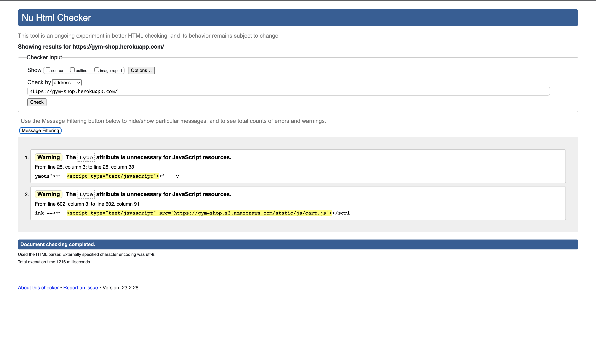
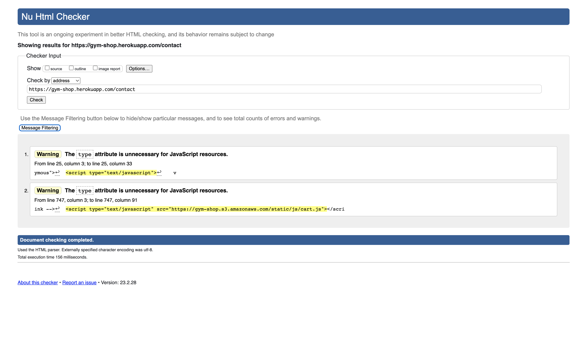
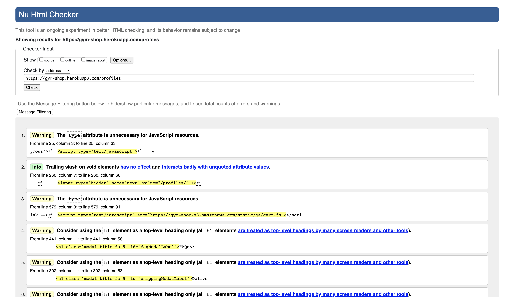
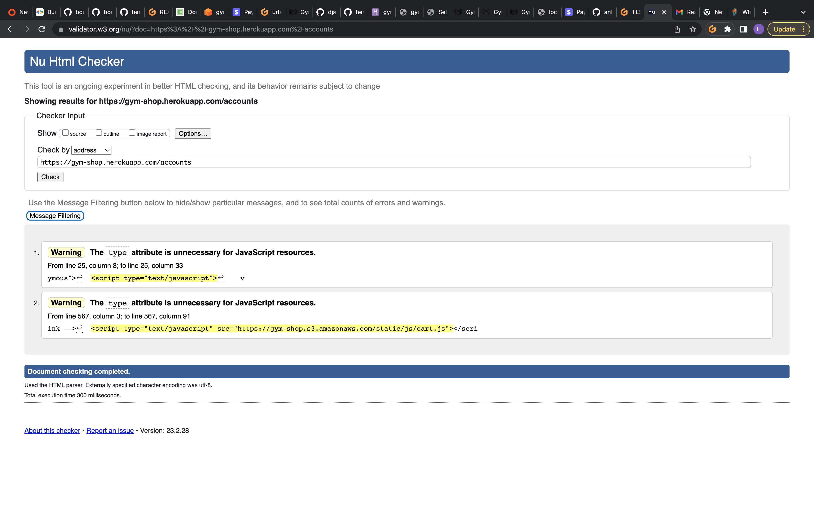
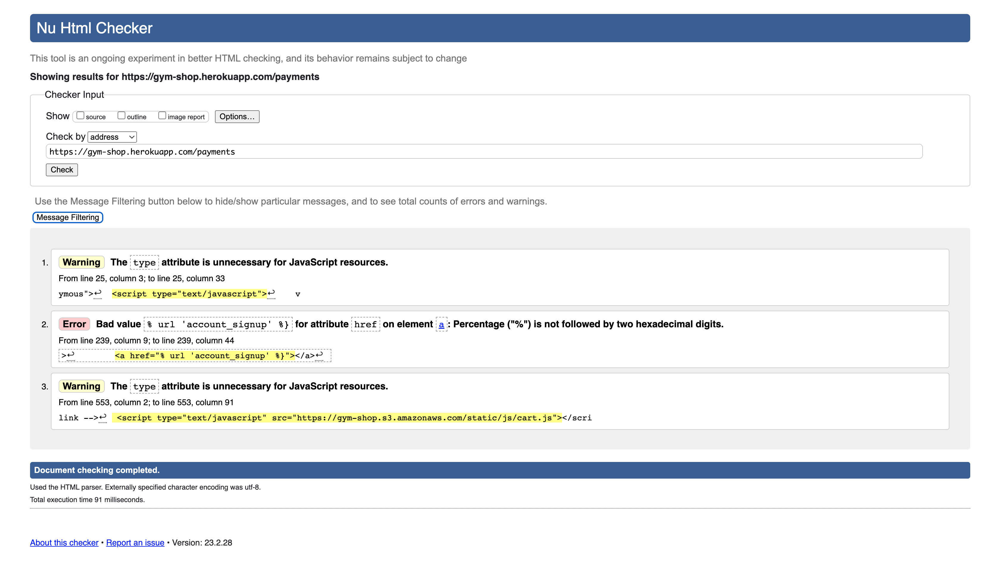
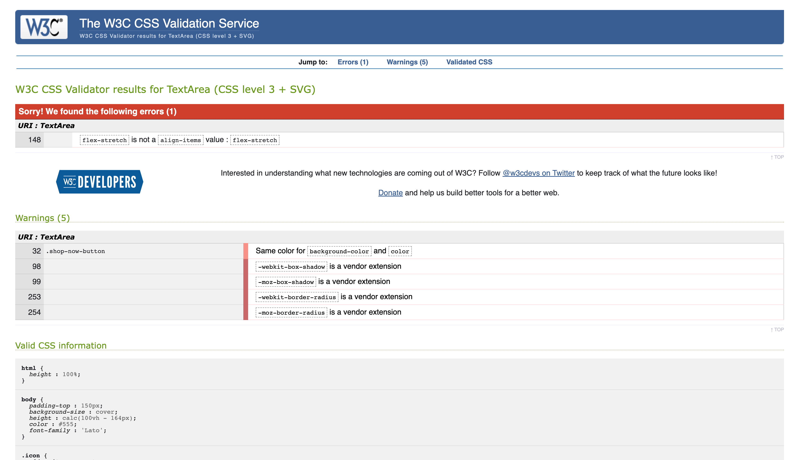
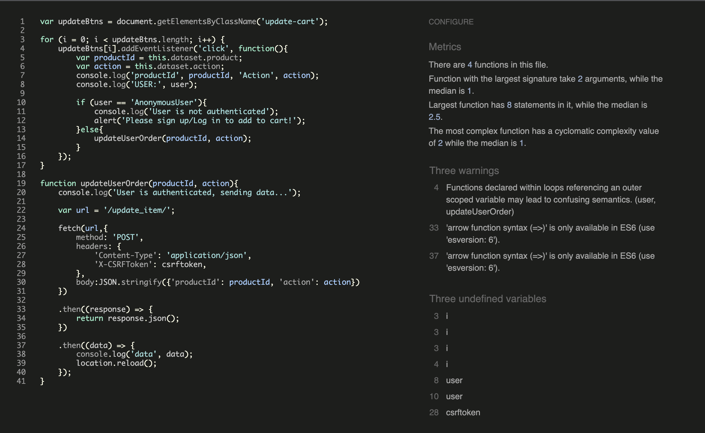
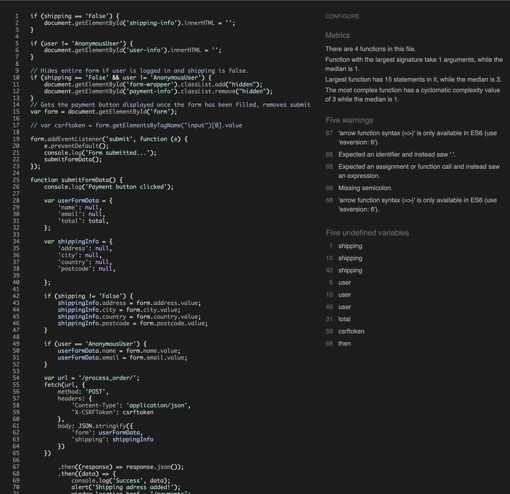

# Testing 

## Validator Testing 

### HTML

- Some errors where found in `store app` when passed through the official [W3C's HTML Validator](https://validator.w3.org/nu/?doc=https://gym-shop.herokuapp.com/) and have now been amended.

>

- No errors where found in `contact app` when passed through the official [W3C's HTML Validator](https://validator.w3.org/nu/?doc=https://gym-shop.herokuapp.com/contact).

>

- No errors where found in `profile app` when passed through the official [W3C's HTML Validator](https://validator.w3.org/nu/?doc=https://gym-shop.herokuapp.com/profile).

>

- No errors where found in `accounts app` when passed through the official [W3C's HTML Validator](https://validator.w3.org/nu/?doc=https://gym-shop.herokuapp.com/accounts).

>

- 1 error was found in `payment app` when passed through the official [W3C's HTML Validator](https://validator.w3.org/nu/?doc=https://gym-shop.herokuapp.com/payment) and has now been amended.

>


### CSS

  - 1 errors were found in any CSS files throughout the site when passed through the official CSS validator. All errors found were related to Bootstrap documentation and not from my custom CSS files. This error was fixed:
  
>

- `payment.css` was taking from stripe documentation

### JavaScript

- No errors were found when `cart.js` was passed through the official [JSHint](https://jshint.com/) JavaScript validator., just 3 warnings;

>

- No errors were found when `checkout.js` was passed through the official [JSHint](https://jshint.com/) JavaScript validator., just 5 warnings;

>

- `payment.js` was taken from stripe documentation

- No errors were found when `stripe_elements.js` was passed through the official [JSHint](https://jshint.com/) JavaScript validator.

>

### Python

- All Python code was valiadated with [pep8ish](https://pep8ci.herokuapp.com//)

  - No errors were returned and all code met PEP8 compliance when `store/admin.py` file was passed through Code Institute's Python Linter

    [store/admin.py validation](documentation/testing/validation/store.admin.py.png)
  
   - No errors were returned and all code met PEP8 compliance when `store/forms.py` file was passed through Code Institute's Python Linter

    [store/forms.py validation](documentation/testing/validation/store.forms.py.png)

   - No errors were returned and all code met PEP8 compliance when `store/models.py` file was passed through Code Institute's Python Linter

    [store/models.py validation](documentation/testing/validation/store.models.py.png)

   - No errors were returned and all code met PEP8 compliance when `store/urls.py` file was passed through Code Institute's Python Linter

    [store/urls.py validation](documentation/testing/validation/store.urls.py.png)

   - No errors were returned and all code met PEP8 compliance when `store/views.py` file was passed through Code Institute's Python Linter

    [store/views.py validation](documentation/testing/validation/store.views.py.png)

   - No errors were returned and all code met PEP8 compliance when `contact/admin.py` file was passed through Code Institute's Python Linter

   [contact/admin.py validation](documentation/testing/validation/contact.admin.py.png)

   - No errors were returned and all code met PEP8 compliance when `contact/forms.py` file was passed through Code Institute's Python Linter

   [contact/forms.py validation](documentation/testing/validation/contact.forms.py.png)

   - No errors were returned and all code met PEP8 compliance when `contact/models.py` file was passed through Code Institute's Python Linter

   [contact/models.py validation](documentation/testing/validation/contact.models.py.png)

   - No errors were returned and all code met PEP8 compliance when `contact/urls.py` file was passed through Code Institute's Python Linter

   [contact/urls.py validation](documentation/testing/validation/contact.urls.py.png)

   - No errors were returned and all code met PEP8 compliance when `contact/views.py` file was passed through Code Institute's Python Linter

   [profile/views.py validation](documentation/testing/profile.views.py.png)

   - No errors were returned and all code met PEP8 compliance when `profile/admin.py` file was passed through Code Institute's Python Linter

   [profile/admin.py validation](documentation/testing/profile.admin.py.png)

   - No errors were returned and all code met PEP8 compliance when `profile/forms.py` file was passed through Code Institute's Python Linter

   [profile/forms.py validation](documentation/testing/profile.forms.py.png)

   - No errors were returned and all code met PEP8 compliance when `profile/models.py` file was passed through Code Institute's Python Linter

   [profile/models.py validation](documentation/testing/profile.models.py.png)

   - No errors were returned and all code met PEP8 compliance when `profile/urls.py` file was passed through Code Institute's Python Linter

   [profile/urls.py validation](documentation/testing/profile.urls.py.png)

   - No errors were returned and all code met PEP8 compliance when `profile/views.py` file was passed through Code Institute's Python Linter

   [profile/views.py validation](documentation/testing/profile.views.py.png)

   - No errors were returned and all code met PEP8 compliance when `payment/admin.py` file was passed through Code Institute's Python Linter

   [payment/admin.py validation](documentation/testing/payment.admin.py.png)

   - No errors were returned and all code met PEP8 compliance when `payment/models.py` file was passed through Code Institute's Python Linter

   [payment/models.py validation](documentation/testing/payment.models.py.png)

   - No errors were returned and all code met PEP8 compliance when `payment/urls.py` file was passed through Code Institute's Python Linter

   [payment/urls.py validation](documentation/testing/payment.urls.py.png)

   - No errors were returned and all code met PEP8 compliance when `payment/views.py` file was passed through Code Institute's Python Linter

   [payment/views.py validation](documentation/testing/payment.views.py.png)


### Fixed Bugs


## Browser Compatibility


## Responsiveness


## User Story Testing


## Defensive Programming Testing

- Code is implemented on all admin features to require user login and to verify that the logged in user has admin status. If a user is not logged in or is not an admin, they will be redirected and unable to perform admin privileges. This works even when trying to brute force a url.
  `@login_required` on admin views to require user to be logged in. The following code was used to verify admin status:
  ```
  if not request.user.is_superuser:
        messages.error(request, "Sorry, no access - admins only!")
        return redirect(reverse("home"))
  ```
  If the user is a superuser i.e., admin, then they will not be redirected and will have access to admin functionality. This functionality was manually tested and is functioning correctly.