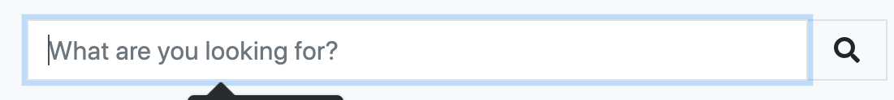
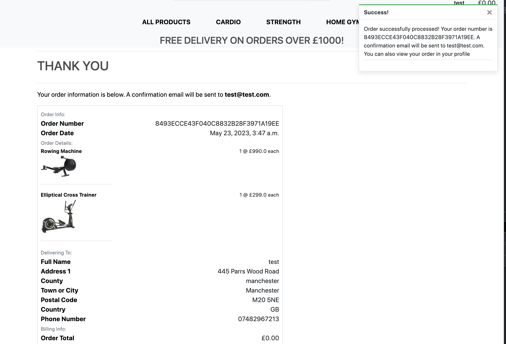
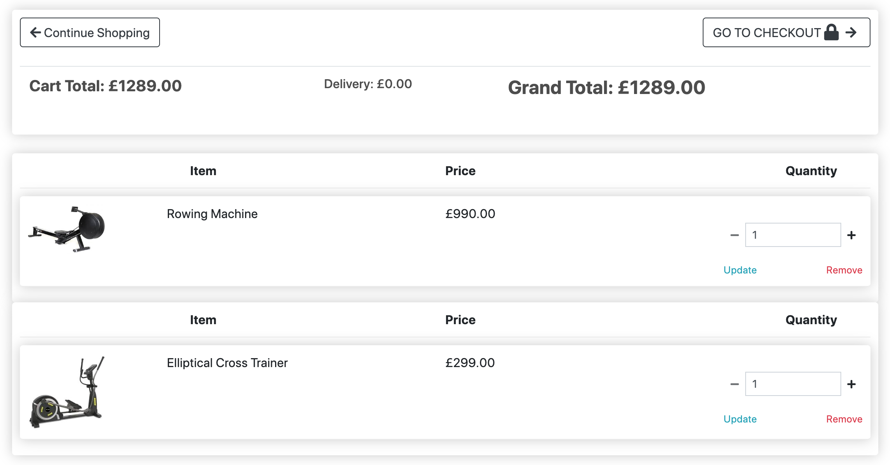
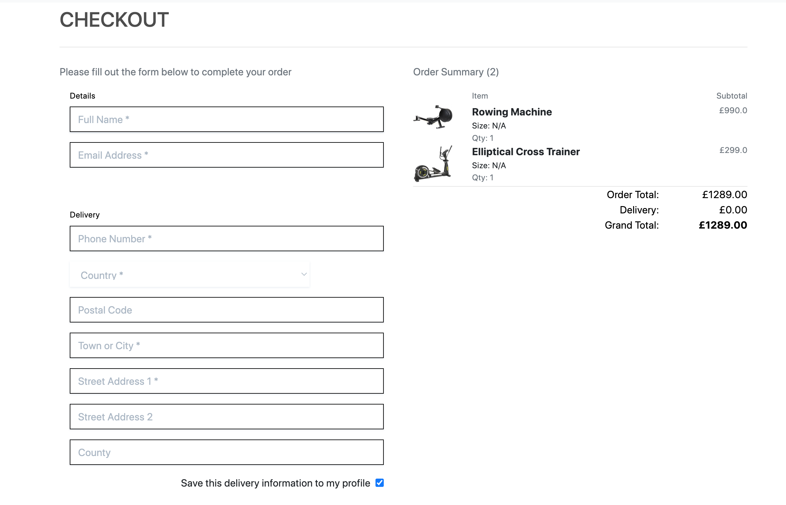
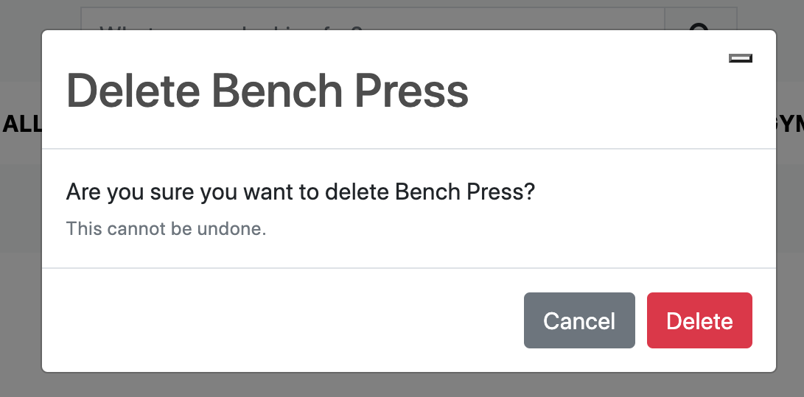

# Testing 

## Validator Testing 

### HTML

-  - No errors where found home` when passed through the official [W3C's HTML Validator](https://validator.w3.org/nu/?doc=https://gym-shop.herokuapp.com/home).

>

- Some errors where found in `store app` when passed through the official [W3C's HTML Validator](https://validator.w3.org/nu/?doc=https://gym-shop.herokuapp.com/) and have now been amended.

>

- No errors where found in `contact app` when passed through the official [W3C's HTML Validator](https://validator.w3.org/nu/?doc=https://gym-shop.herokuapp.com/contact).

>

- No errors where found in `profile app` when passed through the official [W3C's HTML Validator](https://validator.w3.org/nu/?doc=https://gym-shop.herokuapp.com/profile).

>

- No errors where found in `accounts app` when passed through the official [W3C's HTML Validator](https://validator.w3.org/nu/?doc=https://gym-shop.herokuapp.com/accounts).

>

 - No errors where found in `checkout app` when passed through the official [W3C's HTML Validator](https://validator.w3.org/nu/?doc=https://gym-shop.herokuapp.com/checkout).

>

 - No errors where found in `cart app` when passed through the official [W3C's HTML Validator](https://validator.w3.org/nu/?doc=https://gym-shop.herokuapp.com/cart).

>


### CSS

  - 1 errors were found in any CSS files throughout the site when passed through the official CSS validator. This error was fixed:
  
>

- No errors found in `checkout.css` 

>

- No errors found in `profile.css` 

>

### JavaScript

- `countryfield.js` was taking from Boutique Ado project

- No errors were found when `stripe_elements.js` was passed through the official [JSHint](https://jshint.com/) JavaScript validator.

>

- All Python code was valiadated with [pep8ish](https://pep8ccartuapp.com//)

  - No errors were returned and all code met PEP8 compliance when `store/admin.py` file was passed through Code Institute's Python Linter

    [store/admin.py validation](documentation/testing/validation/store.admin.py.png)
  
   - No errors were returned and all code met PEP8 compliance when `store/forms.py` file was passed through Code Institute's Python Linter

    [store/forms.py validation](documentation/testing/validation/store.forms.py.png)

   - No errors were returned and all code met PEP8 compliance when `store/models.py` file was passed through Code Institute's Python Linter

    [store/models.py validation](documentation/testing/validation/store.models.py.png)

   - No errors were returned and all code met PEP8 compliance when `store/urls.py` file was passed through Code Institute's Python Linter

    [store/urls.py validation](documentation/testing/validation/store.urls.py.png)

   - No errors were returned and all code met PEP8 compliance when `store/views.py` file was passed through Code Institute's Python Linter

    [store/views.py validation](documentation/testing/validation/store.views.py.png)

   - No errors were returned and all code met PEP8 compliance when `contact/admin.py` file was passed through Code Institute's Python Linter

   [contact/admin.py validation](documentation/testing/validation/contact.admin.py.png)

   - No errors were returned and all code met PEP8 compliance when `contact/forms.py` file was passed through Code Institute's Python Linter

   [contact/forms.py validation](documentation/testing/validation/contact.forms.py.png)

   - No errors were returned and all code met PEP8 compliance when `contact/models.py` file was passed through Code Institute's Python Linter

   [contact/models.py validation](documentation/testing/validation/contact.models.py.png)

   - No errors were returned and all code met PEP8 compliance when `contact/views.py` file was passed through Code Institute's Python Linter

   [contact/views.py validation](documentation/testing/validation/contact.views.py.png)

   - No errors were returned and all code met PEP8 compliance when `contact/urls.py` file was passed through Code Institute's Python Linter

   [contact/urls.py validation](documentation/testing/validation/contact.urls.py.png)

   - No errors were returned and all code met PEP8 compliance when `profile/admin.py` file was passed through Code Institute's Python Linter

   [profile/admin.py validation](documentation/testing/validation/profile.admin.py.png)

   - No errors were returned and all code met PEP8 compliance when `profile/forms.py` file was passed through Code Institute's Python Linter

   [profile/forms.py validation](documentation/testing/validation/profile.forms.py.png)

   - No errors were returned and all code met PEP8 compliance when `profile/models.py` file was passed through Code Institute's Python Linter

   [profile/models.py validation](documentation/testing/validation/profile.models.py.png)

   - No errors were returned and all code met PEP8 compliance when `profile/urls.py` file was passed through Code Institute's Python Linter

   [profile/urls.py validation](documentation/testing/validation/profile.urls.py.png)

   - No errors were returned and all code met PEP8 compliance when `profile/views.py` file was passed through Code Institute's Python Linter

   [profile/views.py validation](documentation/testing/validation/profile.views.py.png)

   - No errors were returned and all code met PEP8 compliance when `cart/cart_tools.py` file was passed through Code Institute's Python Linter

   [cart/cart_tools.py validation](documentation/testing/validation/cart.cart_tools.py.png)
   - No errors were returned and all code met PEP8 compliance when `cart/contexts.py` file was passed through Code Institute's Python Linter

   [cart/contexts.py validation](documentation/testing/validation/cart.contexts.py.png)

   - No errors were returned and all code met PEP8 compliance when `cart/urls.py` file was passed through Code Institute's Python Linter

   [cart/urls.py validation](documentation/testing/validation/cart.urls.py.png)

   - No errors were returned and all code met PEP8 compliance when `cart/views.py` file was passed through Code Institute's Python Linter

   [cart/views.py validation](documentation/testing/validation/cart.views.py.png)

   - No errors were returned and all code met PEP8 compliance when `gym_shop/settings.py` file was passed through Code Institute's Python Linter

   [gym_shop/settings.py validation](documentation/testing/validation/gym_shop.settings.py.png)

   - No errors were returned and all code met PEP8 compliance when `gym_shop/urls.py` file was passed through Code Institute's Python Linter

   [gym_shop/urls.py validation](documentation/testing/validation/gym_shop.urls.py.png)

   - No errors were returned and all code met PEP8 compliance when `home/admin.py` file was passed through Code Institute's Python Linter

   [home/admin.py validation](documentation/testing/validation/home.admin.py.png)

   - No errors were returned and all code met PEP8 compliance when `home/forms.py` file was passed through Code Institute's Python Linter

   [home/forms.py validation](documentation/testing/validation/home.forms.py.png)

   - No errors were returned and all code met PEP8 compliance when `home/models.py` file was passed through Code Institute's Python Linter

   [home/models.py validation](documentation/testing/validation/home.models.py.png)

   - No errors were returned and all code met PEP8 compliance when `home/views.py` file was passed through Code Institute's Python Linter

   [home/views.py validation](documentation/testing/validation/home.views.py.png)

   - No errors were returned and all code met PEP8 compliance when `home/urls.py` file was passed through Code Institute's Python Linter

   [home/urls.py validation](documentation/testing/validation/home.urls.py.png)
   
   - No errors were returned and all code met PEP8 compliance when `checkout/admin.py` file was passed through Code Institute's Python Linter

    [checkout/admin.py validation](documentation/testing/validation/checkout.admin.py.png)

   - No errors were returned and all code met PEP8 compliance when `checkout/apps.py` file was passed through Code Institute's Python Linter

    [checkout/apps.py validation](documentation/testing/validation/checkout.apps.py.png)

   - No errors were returned and all code met PEP8 compliance when `checkout/forms.py` file was passed through Code Institute's Python Linter

    [checkout/forms.py validation](documentation/testing/validation/checkout.forms.py.png)

   - No errors were returned and all code met PEP8 compliance when `checkout/models.py` file was passed through Code Institute's Python Linter

    [checkout/models.py validation](documentation/testing/validation/checkout.models.py.png)

   - No errors were returned and all code met PEP8 compliance when `checkout/signals.py` file was passed through Code Institute's Python Linter

    [checkout/signals.py validation](documentation/testing/validation/checkout.signals.py.png)

   - No errors were returned and all code met PEP8 compliance when `checkout/urls.py` file was passed through Code Institute's Python Linter

    [checkout/urls.py validation](documentation/testing/validation/checkout.urls.py.png)

   - No errors were returned and all code met PEP8 compliance when `checkout/views.py` file was passed through Code Institute's Python Linter

    [checkout/views.py validation](documentation/testing/validation/checkout.views.py.png)

   - No errors were returned and all code met PEP8 compliance when `checkout/webhooks.py` file was passed through Code Institute's Python Linter

    [checkout/webhooks.py validation](documentation/testing/validation/checkout.webhooks.py.png)

   - No errors were returned and all code met PEP8 compliance when `checkout/webhook_handler.py` file was passed through Code Institute's Python Linter

    [checkout/webhook_handler.py validation](documentation/testing/validation/checkout.webhook_handler.py.png)


### Fixed Bugs

- I had many bugs during deployment but this was due to environment variables not being set properly and had trouble with aws connecting.
- I had many bugs with the implimented stripe js payment but was just passing incorrect information to the function.
- Allauth was also not working after deployment and this was due to email settings not being set correctly and debug.
- Fixed issue with comment body not loading correctly, this was due to crispy form tags not being declared at top of html file.
- Bug where order confirmation grand total and delivery was showing as £0, this was due to duplicate signals with the same name.


## Browser Compatibility

- Website launched successfully on `Firefox`

  >

- Website launched successfully on `Safari`

  >

- Website launched successfully on `Chrome`

  >>
  
## Responsiveness

- Website viewed on a Smartphone:

  >

- Website viewed on a tablet device:

  >

- Website viewed on a laptop device:

 >


## User Story Testing

A target user of the GymShop website will want to:

- [x] Register an account
   >Users can register an account at GymShop, the backend of this functionality is handled by [django-allauth](https://django-allauth.readthedocs.io/en/latest/installation.html).
   >

- [x] Store personal default delivery information
   >Profile owners can store their default delivery information - making checkout easier as the delivery section of the order form auto-populates.

- [x] Amend profile information
   >Default delivery information can be updated.
   >

- [x] View past orders
   >Profile owners will be able to view their previous order history.
   >

- [x] Reset their profile password
   >Profile owners will be able to reset their password via email-authentication, this functionality is handled by [django-allauth](https://django-allauth.readthedocs.io/en/latest/
   >

- [x] Navigate the site
   >The navbar and footer make it easy for users to navigate the site as well as useful buttons and internal links throughout the website. The site is simple to navigate.
   >
  

- [x] View products
   >All products can be viewed in the store.
   >

- [x] Filter Deilen products
   >Products can be searched for specific keywords in the search bar.
   >

- [x] Purchase products
   >Users can purchase products by adding the desired quantities to their cart and continuing with checkout to pay and finalise their order.
   >

- [x] Amend their order
   >In the cart, users will be given an overview of their proposed purchase. Users can then amend quantities of an item, remove items competely and continue shopping if they desire. 
   >

- [x] See an order summary with all cost details
   >An order summary is listed in the cart and again at checkout showing all costs and total cost of the purchase. There are no hidden costs. The amount that a user will be charged is clearly displayed before purchase.
   >

- [x] Checkout safely and securely
   >The site uses Stripe Payments to acheive safe and secure transactions. More can be read about this at [Stripe.com](https://stripe.com/en-gb).
   >

- [*] Receive order confirmation
   >Once an order has been made, the user will be shown the checkout success page which informs the user that their order has been processed. Email confirmation will also be sent to the user. Additionally, if a user has a profile they will be able to see processed order in their order history on their profile.

- [x] Contact GymShop
   >Store users will need to be able to contact GymShop if they have any questions or need help with their order. The website has multiple useful links in the footer which outline company policy on returns and refunds, delivery and shipping, and privacy policy as well as an FAQ section. These links are full of customer information they may wish to read before making a purchase. If store users have any other queries or concerns, there is a contact us section where a form is submitted with a customer message.
   >

- [x] Manage their account
   >Users are able to login, logout, register, confirm their email address, and reset their password. All of this functionality is handled by [django-allauth](https://django-allauth.readthedocs.io/en/latest/installation.html).

An admin of the Gymshop app will want to:

- [x] Have secure access to product management
   >Login is required to access any urls regarding product management. If the user logged in is not identified as an admin of the site, they will be redirected and thrown an error. Only admins have access to admin privileges.
   
- [x] Add new products
   >Admins can easily add new products by navigating to the product management section under their account. Completing and submitting the form will result in a new product being displayed on the site.
   >

- [x] Edit existing products
   >From a product's details page, an admin can easily update the details of said product.
   >

- [x] Delete products
   >From a product's details page, an admin can easily delete said product. Before deletion a modal is triggered to ensure no accidental deletion.
   >

- [x] View all orders, products, product categories, and customer messages
   >All of this information can be viewed when an admin logs into the customised django admin. Django provides a built in admin interface which acts as a internal management tool. More information can be read about Django admin [here](https://docs.djangoproject.com/en/4.1/ref/contrib/admin/). Gymshop's django admin can be accessed [here](https://gym-shop.herokuapp.com/admin/) (please note, admin login is required). 

## Defensive Programming Testing

- Code is implemented on all admin features to require user login and to verify that the logged in user has admin status. If a user is not logged in or is not an admin, they will be redirected and unable to perform admin privileges. This works even when trying to brute force a url.
  `@login_required` on admin views to require user to be logged in. The following code was used to verify admin status:
  ```
  if not request.user.is_superuser:
        messages.error(request, "Sorry, no access - admins only!")
        return redirect(reverse("home"))
  ```
  If the user is a superuser i.e., admin, then they will not be redirected and will have access to admin functionality. This functionality was manually tested and is functioning correctly.